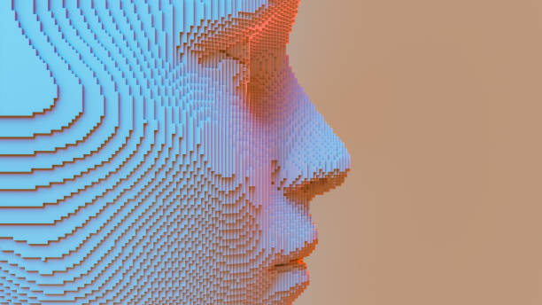
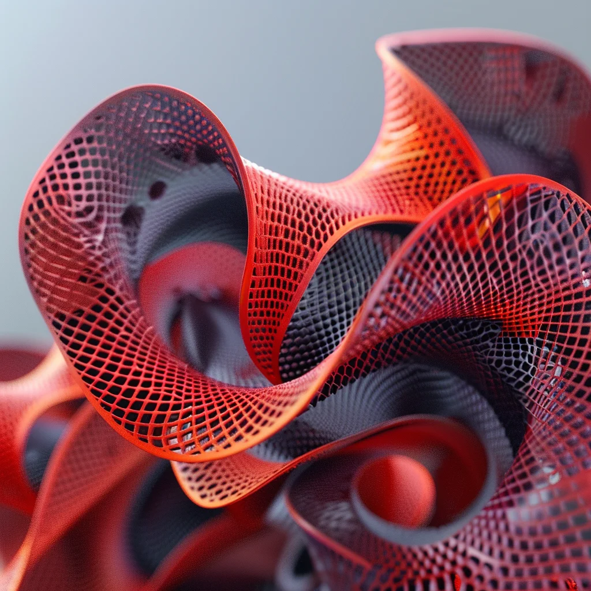
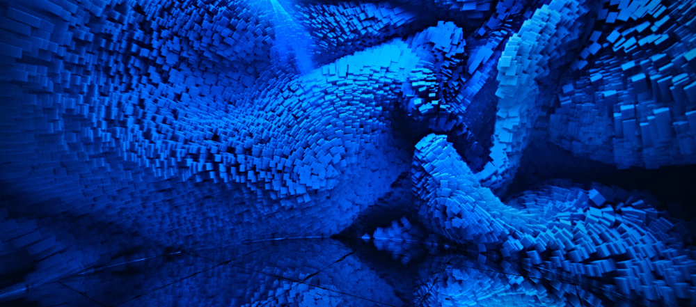
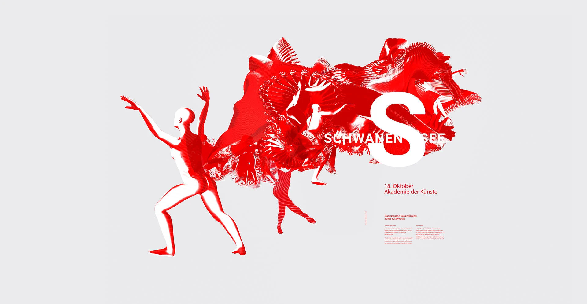
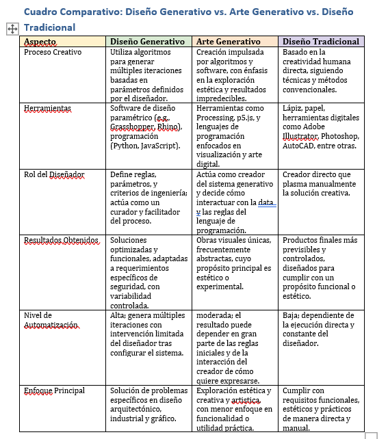

#### Definiciones de diseño generativo y arte generativo

##### 1. El arte generativo se refiere a obras de arte que son creadas mediante algoritmos y procesos automáticos. Utilizando códigos y datos, los artistas pueden generar formas, patrones y sonidos que evolucionan y cambian 
         en función de parámetros predefinidos o datos en tiempo real. Este tipo de arte se distingue por su capacidad de producir resultados únicos e impredecibles, desafiando las nociones tradicionales de control y autoría 
         en la creación artística. fuente de la definicion antes vista: https://thebridge.tech/blog/arte-generativo
         

         
         
##### 2. Diseño Generativo: Explorando Posibilidades Creativas
         El diseño generativo es una tendencia en auge en diversos campos como la ingeniería, arquitectura y arte. Utiliza la inteligencia artificial para generar soluciones de diseño de manera eficiente. A través de 
         algoritmos estructurados y computación en la nube, los diseñadores exploran una amplia gama de posibilidades creativas.

         fuente sitio web: https://www.lobostudio.es/diseno-generativo/

##### 3. ¿Qué es el arte generativo?

         El arte generativo es una práctica artística que consiste en hacer creaciones que han sido generadas de manera total o parcial por un sistema que puede funcionar con independencia. Lo único que requiere es la 
         intervención humana para accionarlo.

         Se basa en una programación previa y mediante esta, el sistema es capaz de determinar las características que, en su defecto, serían establecidas por la persona creadora o artista. En otras palabras, se trata de 
         algoritmos que son generados por un ordenador y que son los que marcan las directrices a seguir en el funcionamiento del sistema.

       Si bien puede parecer que el protagonismo lo toma el resultado de esta intervención no humana, lo que verdaderamente importa es el proceso y las ideas creativas que llevan hasta él. A pesar de estar en plena expansión 
       por el creciente uso de las tecnologías en todos los ámbitos, no está considerado un movimiento artístico, sino que es una simple metodología para obtener contenidos que son creativos. Podría considerarse también como 
       una fusión de arte y diseño.

        fuente del sitio web: https://www.esdesignbarcelona.com/actualidad/diseno/arte-generativo

##### 4. DEFINICION PATRIK HUEBNER ¨ DISEÑO GENERATIVO ¨

      El término " generativo " tiene su raíz en "generación" o "generar" y significa algo así como "producido", "creado" o "traído a la luz". En el contexto del diseño de comunicaciones impulsado por datos , el diseño 
      generativo se basa en influencias sistémicas y programáticas multifacéticas e incorpora activamente datos -y, por lo tanto, eventos reales- en el proceso de diseño. Este enfoque, y la variedad de estrategias 
      involucradas, permiten la creación de nuevos tipos de sistemas de narración, diseño y marca. Es importante señalar que el término generativo no describe una estética específica, sino más bien un proceso creativo 
      específico que permite que las ideas tomen forma a través de reglas .

      En el diseño generativo, los diseñadores comienzan por comprender el contexto y el mensaje que quieren comunicar. Luego, se someten a un proceso de investigación en profundidad para encontrar los datos que servirán 
      como base para el diseño o la identidad de marca dinámica . A diferencia de los enfoques de diseño tradicionales, que pueden basarse en la intuición o en asociaciones vagas, los diseñadores generativos establecen 
      reglas específicas basadas en mediciones del mundo real . Estas reglas guían un programa informático que, en un proceso de cocreación con el diseñador, genera la forma final del diseño. Este proceso suele estar 
      guiado y habilitado por estrategias de resolución de problemas estructuradas y lógicas que se basan en el pensamiento computacional y el pensamiento sistémico .

      Fuente de esta definicion: https://www.patrik-huebner.com/datadesigndictionary/generative-design/

##### CUADRO COMPARATIVO ENTRE ARTE GENERATIVO, DISEÑO GENERATIVO Y ARTE TRADICIONAL. 

###### ¿ Para mi que es el diseño generativo ?

El diseño generativo es emocionante porque combina incertidumbre y creatividad, ofreciendo resultados inesperados que trascienden los límites del arte tradicional. Con algoritmos diseñados para ser flexibles y no rígidos, se pueden explorar formas, patrones y conceptos que antes eran imposibles de imaginar porque no tenemos el control absoluto.  

Aplicado a las experiencias interactivas, el arte generativo puede captar la atención y causar un impacto profundo en las personas. Tiene el poder de romper la monotonía y provocar emociones únicas, sorprendiendo con algo nunca antes visto. Es una herramienta para conectar con el público de una manera novedosa, ofreciendo entretenimiento y momentos memorables que resuenan más allá de la experiencia inmediata.😊

