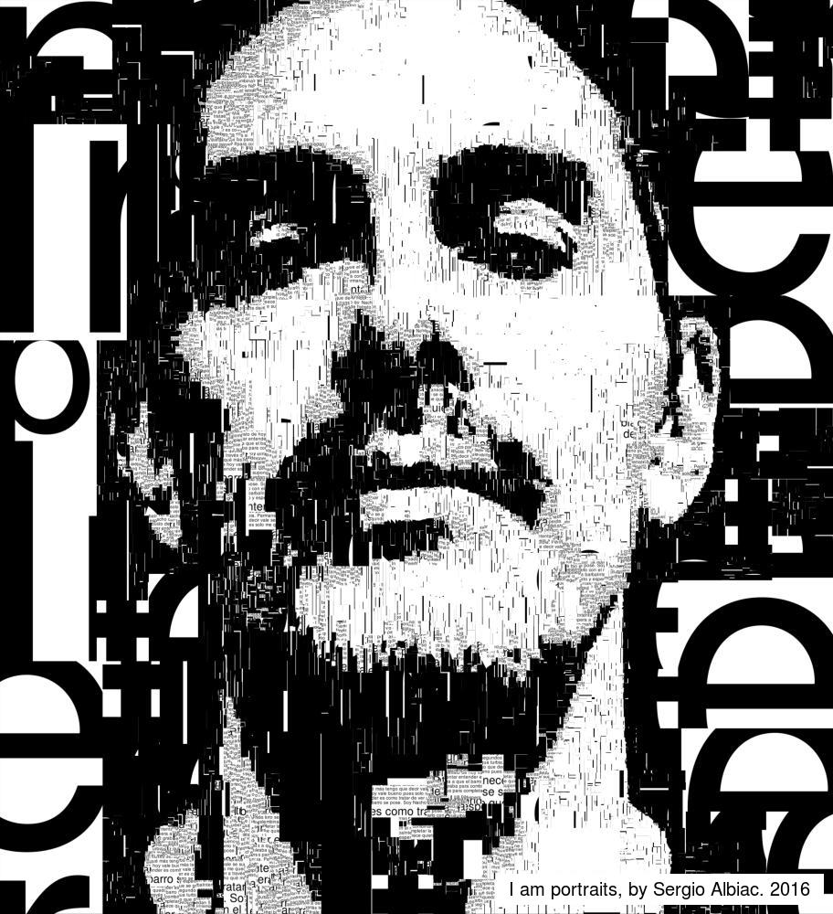
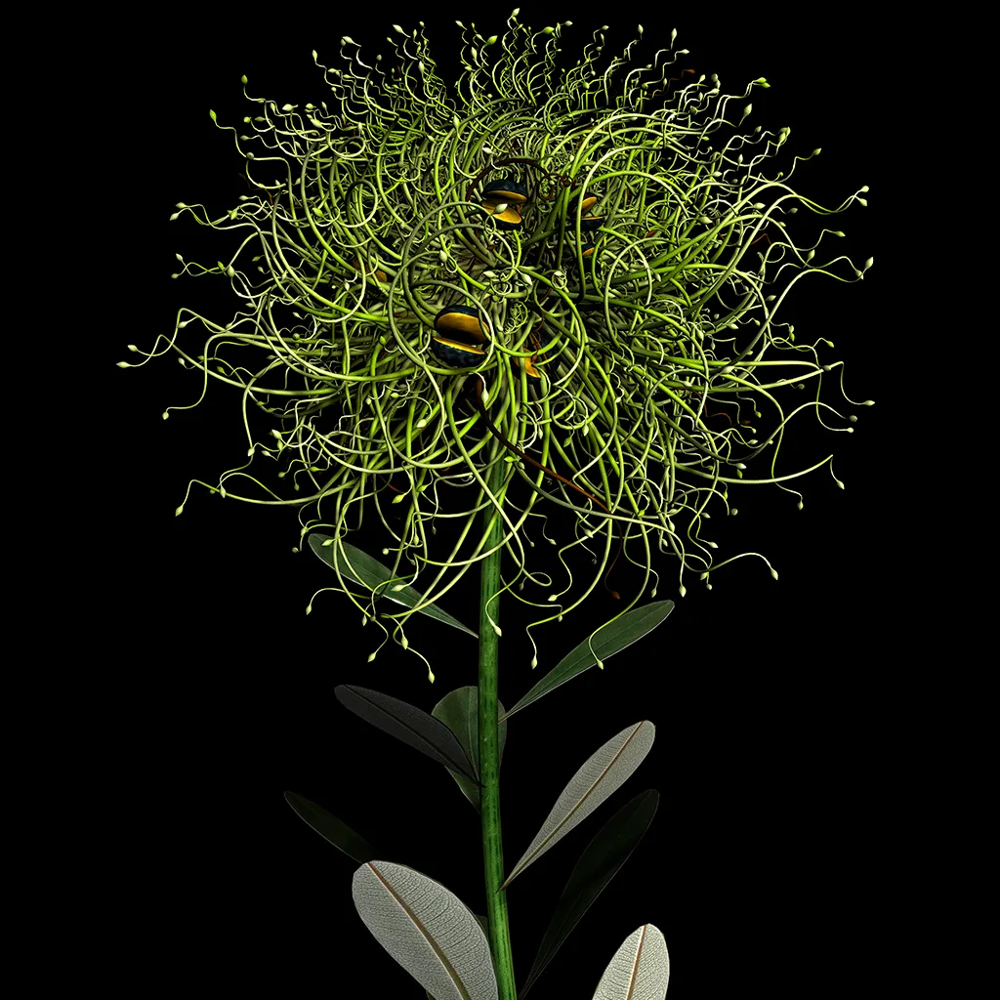

##### PROYECTOS DE ARTE GENERATIVO

#### I AM.

Nombre: I am.

Artista: Sergio Albiac

URL: https://www.sergioalbiac.com/wall/i-am.html

Descripcion: El proyecto crea retratos generativos a partir de las descripciones verbales de los participantes, transformadas en texto y procesadas mediante código personalizado. Utiliza análisis semántico y machine learning para generar imágenes que fusionan identidad personal con referencias filosóficas y literarias. Cada retrato es único, inesperado y reflexivo sobre la identidad humana.

Porque me llamo la atencion: Me gusta porque me parece algo muy personal el hecho de que tu retrato se haga con tu propia voz. Es una forma única de capturar tu esencia, no solo visualmente, sino también a través de la manera en que te expresas. Es como si, al usar tu voz, realmente se estuviera reflejando algo más profundo y auténtico de ti.

#### Morphogenesis Series

Nombre: Morphogenesis Series

Artista: Jon McCormack

URL: https://jonmccormack.info/project/morphogenesis-series

Descripcion: Utiliza software personalizado para simular el crecimiento de especies nativas australianas a través de un "ADN digital". Este ADN puede mutar y evolucionar, creando versiones surrealistas de la flora que, aunque estructuralmente coherentes, no podrían existir en la naturaleza. Las imágenes generadas se imprimen como fotografías archivables.

Porque me llamo la atencion: Lo que me encanta de este proyecto es que, gracias a la programación, se logran crear plantas y fauna que parecen de otro planeta. Los tonos verdes brillantes y los patrones especiales me fascinan, ya que tienen una vibración única. Los colores naturales y vibrantes le dan una sensación de frescura y belleza que me atrae mucho.

#### FUSE

Nombre: Fuse

Artista: Scott Draves

URL: https://scottdraves.com/fuse

Descripcion: La obra utiliza el algoritmo **Fuse** para crear un autorretrato a partir de un primer plano de los ojos del artista. Las piezas de la imagen se reorganizan para aproximarse a la fotografía original, creando una representación visual compleja. Este proceso refleja la vulnerabilidad del artista mientras parece observarnos desde diferentes ángulos.

Porque me llamo la atencion: Me encanta esta obra porque transforma los ojos del artista en un mosaico único, mostrando vulnerabilidad y profundidad. Es como si el algoritmo no solo reconstruyera la imagen, sino que también reflejara distintas perspectivas del artista.

