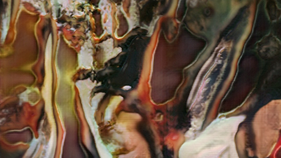
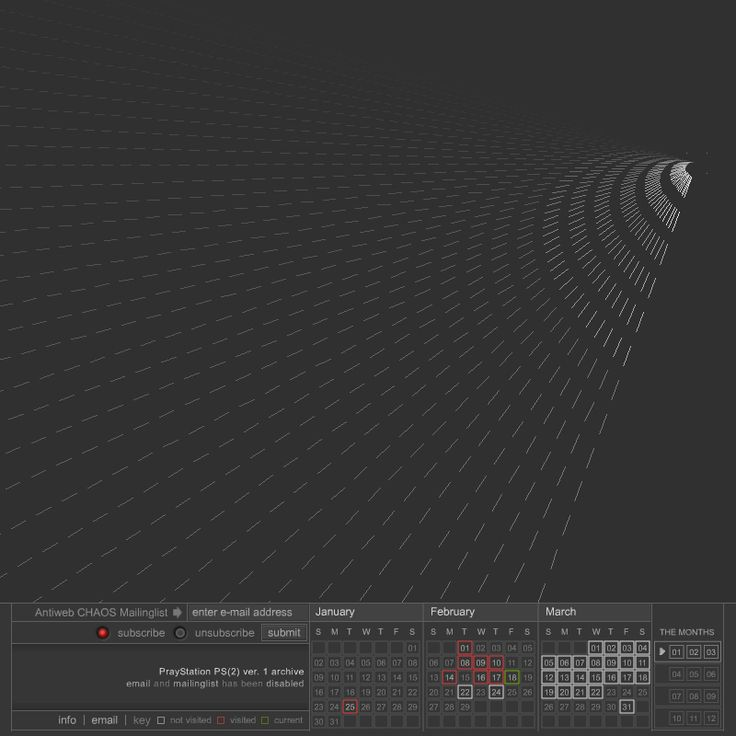
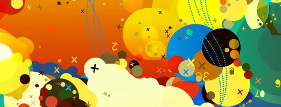

##### 

# ANÁLISIS DE ARTISTAS GENERATIVOS

1. **Casey Reas**  
Casey Reas es uno de los pioneros más importantes en el arte generativo. Nació en 1972 en los Estados Unidos y es conocido por ser co-creador de **Processing**, un lenguaje de programación de código abierto que facilita la creación de arte visual interactivo. Reas utiliza algoritmos y código para crear obras que exploran la relación entre la tecnología, la creatividad y la percepción visual. Sus trabajos son una mezcla de arte y programación, y exploran patrones complejos generados por sistemas automáticos. Ha mostrado su trabajo en exposiciones en museos internacionales, como el Museo de Arte Moderno de Nueva York (MoMA).

2. **Rafael Lozano-Hemmer**  
Rafael Lozano-Hemmer, nacido en 1967 en México, es un artista conocido por sus instalaciones interactivas y obras de arte generativo que combinan tecnología y participación del espectador. A menudo utiliza mecanismos como sensores, luces y proyecciones para crear experiencias dinámicas en las que el público influye directamente en la obra. Su enfoque se centra en la interacción humana con la tecnología y cómo estas experiencias pueden generar un sentido de presencia y comunidad. Algunas de sus obras más conocidas incluyen "33 Questions per Minute" y "Pulse Room". Su trabajo ha sido exhibido en todo el mundo, desde el Museo de Arte Contemporáneo de Montreal hasta el Centro Pompidou de París.

3. **Joshua Davis**  
Joshua Davis es un artista y diseñador estadounidense nacido en 1971, reconocido por su trabajo en el arte generativo y el diseño digital. Utiliza software de programación para crear imágenes y animaciones complejas que se generan mediante algoritmos aleatorios o reglas predefinidas. Davis es uno de los principales exponentes de la estética generativa y ha trabajado con empresas y marcas importantes, además de exhibir su arte en galerías y museos internacionales. A través de su proyecto **"Praystation"**, que es una de sus series más icónicas, crea patrones visuales y arte digital que surgen de la interacción entre el código y la creatividad. Su trabajo también explora la idea de la repetición y la sorpresa dentro de los sistemas programáticos.

## OBRAS 

1. Casey Reas
   
Obra 1: Software Structures (2004)

Técnica: Generación algorítmica, arte generativo interactivo. Reas utiliza un lenguaje de programación para crear imágenes visuales abstractas. En esta serie, las formas geométricas y los patrones aparecen y desaparecen según los algoritmos que siguen reglas predefinidas. Las imágenes no son estáticas, sino que se generan dinámicamente a partir del código.
Herramientas: Processing (un entorno de desarrollo de código abierto creado por Reas y Ben Fry). Este entorno permite a los artistas generar imágenes usando código y visualización de datos. El código detrás de la obra crea imágenes que varían dependiendo de los parámetros definidos en los algoritmos.

Obra 2: Ultraconcentrated, 2003–present

Técnica: Arte generativo, donde los algoritmos crean patrones visuales dinámicos y cambiantes. La obra es impredecible y evoluciona en tiempo real.

Herramientas: Principalmente Processing, un entorno de programación creado por Reas, que permite generar imágenes digitales interactivas a través de código.

La obra refleja cómo la programación puede producir arte abstracto y en constante transformación, combinando la tecnología con la creatividad.

2. Rafael Lozano-Hemmer

Obra 1: 33 Questions per Minute (2000)

Técnica: Instalación interactiva. Lozano-Hemmer utiliza un sistema generativo que presenta una serie de preguntas a los espectadores a una velocidad increíblemente rápida, 33 por minuto, mientras que los participantes interactúan con el sistema. El sistema responde a las interacciones del público mediante tecnología de control de voz, lo que agrega una capa de aleatoriedad a las preguntas.
Herramientas: Tecnología de procesamiento de voz y sensores interactivos. Utilizó dispositivos electrónicos, software de procesamiento y una interfaz que recogía las respuestas de los visitantes y las integraba dentro de la instalación.

Obra 2: Pulse Room (2006)

Técnica: Instalación generativa interactiva. En esta obra, Lozano-Hemmer utiliza sensores para detectar los latidos del corazón de los participantes y generar una luz intermitente que imita los ritmos cardíacos de las personas en la sala. Cada persona interactúa con la instalación al ser monitorizada en tiempo real, creando un vínculo personal entre la obra y el espectador.
Herramientas: Sensores de latido del corazón, luces LED, software de control y algoritmos de procesamiento en tiempo real para traducir los datos biológicos (latidos del corazón) a una visualización generativa.

3. Joshua Davis
   
Obra 1: Praystation (2000-2004)

Técnica: Arte generativo interactivo en tiempo real. Praystation es un proyecto web donde Davis utilizó programación para generar imágenes visuales complejas y dinámicas. Los visitantes de la web podían interactuar con el sistema generativo para crear nuevas composiciones a partir de los algoritmos que él había escrito. Cada acción o clic generaba una nueva visualización de patrones y colores.
Herramientas: Utilizó Flash (antes de su desaparición), ActionScript (lenguaje de programación basado en Flash), y un conjunto de algoritmos personalizados. La interactividad web permitió a los usuarios influir directamente en las obras generadas.

Obra 2: The Infinite Now (2004)

Técnica: Arte generativo basado en la manipulación de partículas. En esta pieza, Davis crea una serie de imágenes generadas por sistemas de partículas que se desplazan y cambian a medida que el usuario interactúa con la obra. La pieza destaca por su estética fluida, que se forma y reconfigura en función de las reglas predefinidas de programación.
Herramientas: Processing y Flash con ActionScript. Utiliza códigos matemáticos y algoritmos de simulación de partículas que responden a la interacción en tiempo real.

# INFLUENCIAS 

Claro, aquí tienes un resumen más breve:

### **1. Casey Reas**
**Influencias:** Se inspira en el **arte abstracto** (como **Sol LeWitt**), los **sistemas complejos** y el trabajo de **John Conway** con autómatas celulares. También influenciado por la tradición del **arte conceptual** y la **interactividad** en el arte digital.

### **2. Rafael Lozano-Hemmer**
**Influencias:** Su trabajo se basa en la **tecnología electrónica** y la **cibernética**, influenciado por artistas como **Nam June Paik** y el arte **participativo** de **Marcel Duchamp**. También explora la **biometría** y la interacción humana con la tecnología.

### **3. Joshua Davis**
**Influencias:** Se inspira en la **cultura digital**, el **diseño gráfico** y el **arte computacional**. Influenciado por artistas como **Manfred Mohr** y **Vera Molnár**, y la estética de los **primeros días de internet** y el **diseño de interfaces**.

Cada uno toma influencias del **arte abstracto, la tecnología y la interacción digital** para crear su arte generativo.
