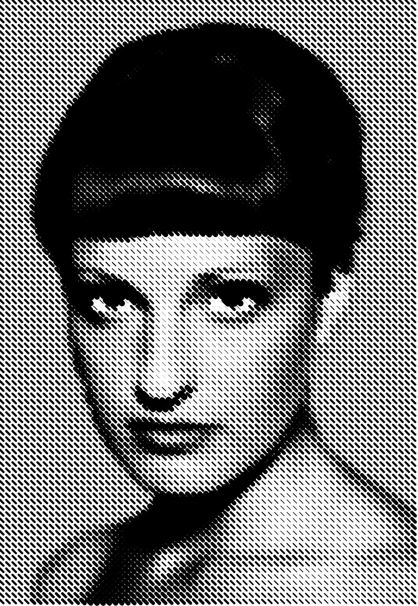

##### 
## Generación de patrones visuales

# Mujer 




```
// P_4_3_1_01
//
// Generative Gestaltung – Creative Coding im Web
// ISBN: 978-3-87439-902-9, First Edition, Hermann Schmidt, Mainz, 2018
// Benedikt Groß, Hartmut Bohnacker, Julia Laub, Claudius Lazzeroni
// with contributions by Joey Lee and Niels Poldervaart
// Copyright 2018
//
// http://www.generative-gestaltung.de
//
// Licensed under the Apache License, Version 2.0 (the "License");
// you may not use this file except in compliance with the License.
// You may obtain a copy of the License at http://www.apache.org/licenses/LICENSE-2.0
// Unless required by applicable law or agreed to in writing, software
// distributed under the License is distributed on an "AS IS" BASIS,
// WITHOUT WARRANTIES OR CONDITIONS OF ANY KIND, either express or implied.
// See the License for the specific language governing permissions and
// limitations under the License.

/**
 * pixel mapping. each pixel is translated into a new element
 *
 * MOUSE
 * position x/y        : various parameters (depending on draw mode)
 *
 * KEYS
 * 1-9                 : switch draw mode
 * s                   : save png
 */
'use strict';

var drawMode = 1;

var img;

function preload() {
  img = loadImage('data/pic.png');
}

function setup() {
  createCanvas(603, 873);
  print(img.width + ' • ' + img.height);
}

function draw() {
  background(255);

  var mouseXFactor = map(mouseX, 0, width, 0.05, 1);
  var mouseYFactor = map(mouseY, 0, height, 0.05, 1);

  for (var gridX = 0; gridX < img.width; gridX++) {
    for (var gridY = 0; gridY < img.height; gridY++) {
      // grid position + tile size
      var tileWidth = width / img.width;
      var tileHeight = height / img.height;
      var posX = tileWidth * gridX;
      var posY = tileHeight * gridY;

      // get current color
      img.loadPixels();
      var c = color(img.get(gridX, gridY));
      // greyscale conversion
      var greyscale = round(red(c) * 0.222 + green(c) * 0.707 + blue(c) * 0.071);

      switch (drawMode) {
      case 1:
        // greyscale to stroke weight
        var w1 = map(greyscale, 0, 255, 15, 0.1);
        stroke(0);
        strokeWeight(w1 * mouseXFactor);
        line(posX, posY, posX + 5, posY + 5);
        break;
      case 2:
        // greyscale to ellipse area
        fill(0);
        noStroke();
        var r2 = 1.1284 * sqrt(tileWidth * tileWidth * (1 - greyscale / 255));
        r2 *= mouseXFactor * 3;
        ellipse(posX, posY, r2, r2);
        break;
      case 3:
        // greyscale to line length
        var l3 = map(greyscale, 0, 255, 30, 0.1);
        l3 *= mouseXFactor;
        stroke(0);
        strokeWeight(10 * mouseYFactor);
        line(posX, posY, posX + l3, posY + l3);
        break;
      case 4:
        // greyscale to rotation, line length and stroke weight
        stroke(0);
        var w4 = map(greyscale, 0, 255, 10, 0);
        strokeWeight(w4 * mouseXFactor + 0.1);
        var l4 = map(greyscale, 0, 255, 35, 0);
        l4 *= mouseYFactor;
        push();
        translate(posX, posY);
        rotate(greyscale / 255 * PI);
        line(0, 0, 0 + l4, 0 + l4);
        pop();
        break;
      case 5:
        // greyscale to line relief
        var w5 = map(greyscale, 0, 255, 5, 0.2);
        strokeWeight(w5 * mouseYFactor + 0.1);
        // get neighbour pixel, limit it to image width
        var c2 = color(img.get(min(gridX + 1, img.width - 1), gridY));
        stroke(c2);
        var greyscale2 = floor(red(c2) * 0.222 + green(c2) * 0.707 + blue(c2) * 0.071);
        var h5 = 50 * mouseXFactor;
        var d1 = map(greyscale, 0, 255, h5, 0);
        var d2 = map(greyscale2, 0, 255, h5, 0);
        line(posX - d1, posY + d1, posX + tileWidth - d2, posY + d2);
        break;
      case 6:
        // pixel color to fill, greyscale to ellipse size
        var w6 = map(greyscale, 0, 255, 25, 0);
        noStroke();
        fill(c);
        ellipse(posX, posY, w6 * mouseXFactor, w6 * mouseXFactor);
        break;
      case 7:
        stroke(c);
        var w7 = map(greyscale, 0, 255, 5, 0.1);
        strokeWeight(w7);
        fill(255, 255 * mouseXFactor);
        push();
        translate(posX, posY);
        rotate(greyscale / 255 * PI * mouseYFactor);
        rect(0, 0, 15, 15);
        pop();
        break;
      case 8:
        noStroke();
        fill(greyscale, greyscale * mouseXFactor, 255 * mouseYFactor);
        rect(posX, posY, 3.5, 3.5);
        rect(posX + 4, posY, 3.5, 3.5);
        rect(posX, posY + 4, 3.5, 3.5);
        rect(posX + 4, posY + 4, 3.5, 3.5);
        break;
      case 9:
        stroke(255, greyscale, 0);
        noFill();
        push();
        translate(posX, posY);
        rotate(greyscale / 255 * PI);
        strokeWeight(1);
        rect(0, 0, 15 * mouseXFactor, 15 * mouseYFactor);
        var w9 = map(greyscale, 0, 255, 15, 0.1);
        strokeWeight(w9);
        stroke(0, 70);
        ellipse(0, 0, 10, 5);
        pop();
        break;
      }
    }
  }
}

function keyReleased() {
  if (key == 's' || key == 'S') saveCanvas(gd.timestamp(), 'png');

  // change draw mode
  if (key == '1') drawMode = 1;
  if (key == '2') drawMode = 2;
  if (key == '3') drawMode = 3;
  if (key == '4') drawMode = 4;
  if (key == '5') drawMode = 5;
  if (key == '6') drawMode = 6;
  if (key == '7') drawMode = 7;
  if (key == '8') drawMode = 8;
  if (key == '9') drawMode = 9;
}


```
      Este código es parte de un proyecto de **Generative Design** que toma una imagen y la convierte en una visualización interactiva utilizando patrones y formas basadas en los valores de los píxeles de la imagen. La interacción del usuario se logra mediante el ratón y las teclas, lo que cambia la manera en que se dibujan las formas.

Te explico los puntos clave:

### 1. **Carga de la imagen:**
   ```javascript
   var img;
   function preload() {
     img = loadImage('data/pic.png');
   }
   ```
   - Se carga una imagen (`pic.png`) desde la carpeta `data` antes de que el programa comience a ejecutarse.

### 2. **Configuración del lienzo:**
   ```javascript
   function setup() {
     createCanvas(603, 873);
     print(img.width + ' • ' + img.height);
   }
   ```
   - Crea un lienzo de 603x873 píxeles para mostrar la visualización.
   - Imprime las dimensiones de la imagen cargada en la consola.

### 3. **Bucle `draw()`:**
   - **Dibuja en el lienzo** de manera continua.
   - Mapea la posición del ratón para afectar las variables `mouseXFactor` y `mouseYFactor`, que son utilizadas para cambiar dinámicamente la apariencia de las formas.

### 4. **Proceso de mapeo de píxeles:**
   Dentro del bucle, recorre cada píxel de la imagen:
   ```javascript
   var c = color(img.get(gridX, gridY)); // obtiene el color del píxel
   var greyscale = round(red(c) * 0.222 + green(c) * 0.707 + blue(c) * 0.071);
   ```
   - Convierte cada píxel a escala de grises usando una fórmula de ponderación para los canales rojo, verde y azul.

### 5. **Modos de dibujo (`drawMode`):**
   Hay 9 modos diferentes, que se activan con las teclas `1-9`. Cada uno modifica la visualización basada en los valores de los píxeles.

   **Ejemplo de modo 1 (líneas con grosor variable):**
   ```javascript
   case 1:
     var w1 = map(greyscale, 0, 255, 15, 0.1);
     stroke(0);
     strokeWeight(w1 * mouseXFactor);
     line(posX, posY, posX + 5, posY + 5);
     break;
   ```
   - En el **modo 1**, el valor de gris de cada píxel determina el grosor de las líneas que se dibujan.

   Cada uno de los otros modos (2-9) usa diferentes transformaciones, como el tamaño de las elipses, la longitud de las líneas, rotaciones, etc.

### 6. **Guardado de imagen:**
   ```javascript
   if (key == 's' || key == 'S') saveCanvas(gd.timestamp(), 'png');
   ```
   - Si presionas la tecla `S`, la visualización actual se guarda como una imagen en formato PNG.

### 7. **Cambio de modo de dibujo con las teclas:**
   ```javascript
   if (key == '1') drawMode = 1;
   if (key == '2') drawMode = 2;
   ```
   - Al presionar las teclas `1-9`, se cambia el modo de dibujo para experimentar con diferentes efectos.

### En resumen:
El código utiliza una imagen y la mapea a una cuadrícula de píxeles. Cada píxel se transforma en una figura (línea, círculo, rectángulo) que cambia según su valor en escala de grises. Además, el programa permite cambiar la forma de visualización de la imagen utilizando teclas, moverla con el ratón y guardarla como una imagen final.


## P_2_1_1_02

https://editor.p5js.org/generative-design/sketches/P_2_1_1_02


Este código genera un patrón en una cuadrícula de 20x20 celdas, donde se dibujan líneas diagonales de dos colores (inicialmente azul y verde). El grosor de las líneas depende de la posición del ratón. Los colores y otros aspectos visuales, como la forma de los extremos de las líneas, se pueden cambiar interactivamente usando las teclas del teclado. Al hacer clic, el patrón se reorganiza de manera aleatoria. Además, se puede guardar la imagen como un archivo PNG presionando una tecla.

## Cambio de colores 
Este cambio se dio en el Set Up 
Antes:
  ```
colorLeft = color(197, 0, 123, alphaLeft);  // Color rosado
colorRight = color(87, 35, 129, alphaRight);  // Color morado
  ```

Despues:

  ```
colorLeft = color(0, 122, 255, alphaLeft);  // Azul
colorRight = color(34, 193, 64, alphaRight);  // Verde

  ```


## P_2_1_1_02

https://editor.p5js.org/arturito745/sketches/S-AuKTOT3

Este código crea una animación interactiva de texto usando p5.js. Muestra el texto "RICARDO" y lo transforma en rutas vectoriales, las cuales se animan de varias formas. Los usuarios pueden manipular la animación usando el teclado (agregar/eliminar texto, cambiar modos de visualización) y el ratón (afectar las formas). Existen diferentes modos de dibujo, como puntos animados, líneas que siguen al ratón, y formas geométricas que se deforman. Los colores de las animaciones son configurables, y el texto se carga como una fuente OpenType.


Los cambios que hice para que las letras y puntos se dibujen en color rojo están en las siguientes funciones, donde se ajustaron las propiedades de fill() y stroke() a los valores 255, 0, 0 (que corresponden al color rojo en formato RGB). Aquí están los detalles de cada parte modificada:

1. Función lines2mouse():
Cambio: Se ajustó el color de la línea a rojo.
Código original:
javascript
Copiar
stroke(0);
Cambio realizado:
javascript
Copiar
stroke(255, 0, 0);  // Rojo en RGB
Explicación: Esta línea ahora dibuja las líneas en rojo.
2. Función animatedPoints():
Cambio: Se cambió el color de los puntos a rojo, tanto para el relleno (fill()) como para el contorno (stroke()).
Código original:
javascript
Copiar
fill(0);
stroke(0);
Cambio realizado:
javascript
Copiar
fill(255, 0, 0);  // Rojo en RGB
stroke(255, 0, 0); // Rojo en RGB
Explicación: Los puntos generados por esta función se dibujan ahora en rojo.
3. Función radialLines():
Cambio: Se ajustó el color de las líneas radiales a rojo.
Código original:
javascript
Copiar
stroke(0);
Cambio realizado:
javascript
Copiar
stroke(255, 0, 0);  // Rojo en RGB
Explicación: Esta línea radial ahora se dibuja en rojo.
4. Función wobblyShapes():
Cambio: Se cambió el color de las formas que se dibujan (triángulos, líneas, etc.) a rojo.
Código original:
javascript
Copiar
fill(0);
stroke(0);
Cambio realizado:
javascript
Copiar
fill(255, 0, 0);  // Rojo en RGB
stroke(255, 0, 0); // Rojo en RGB
Explicación: Las formas generadas en esta función se dibujan en rojo.
5. Función outwardLines():
Cambio: Se cambió el color de las líneas radiales a rojo.
Código original:
javascript
Copiar
stroke(0);
Cambio realizado:
javascript
Copiar
stroke(255, 0, 0);  // Rojo en RGB
strokeWeight(0.5);
fill(255, 0, 0); // Rojo en RGB
Explicación: Esta función también dibuja las líneas que se extienden desde los puntos de forma roja.
Resumen de los cambios realizados:
En cada una de estas funciones, el color predeterminado de los puntos, líneas o formas se cambió a rojo usando el valor stroke(255, 0, 0) para el contorno y fill(255, 0, 0) para el relleno.
¿Por qué se hizo esto?
El objetivo de los cambios fue hacer que todas las formas que se dibujan en el lienzo (puntos, líneas, y otras formas geométricas) sean de color rojo, independientemente de la forma o del tipo de visualización.

Si tienes alguna pregunta o necesitas alguna modificación adicional, ¡dímelo!
